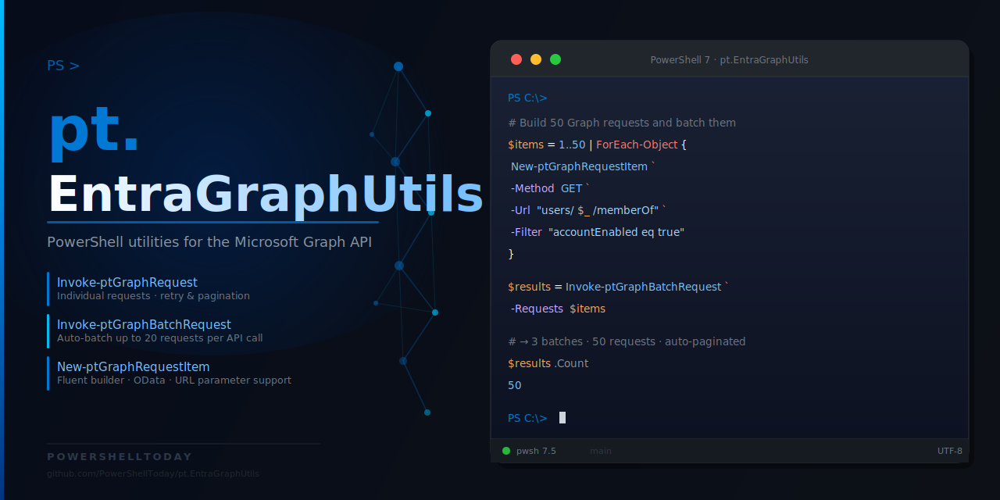

# pt.EntraGraphUtils

[](https://github.com/PowerShellToday/pt.EntraGraphUtils/actions/workflows/ci.yml)
[](https://codecov.io/gh/PowerShellToday/pt.EntraGraphUtils)
[](https://www.powershellgallery.com/packages/pt.EntraGraphUtils)

PowerShell utilities for the Microsoft Graph REST API — high-performance JSON batching, individual requests, and a fluent request-item builder.



## Installation

### PowerShell Gallery

```powershell
Install-Module pt.EntraGraphUtils -Scope CurrentUser
```

### From source

```powershell
git clone https://github.com/PowerShellToday/pt.EntraGraphUtils.git
cd pt.EntraGraphUtils
Import-Module ./src/pt.EntraGraphUtils.psd1 -Force
```

## Prerequisites

All functions call `Invoke-MgGraphRequest` internally, so the
`Microsoft.Graph.Authentication` module must be installed and you must be
connected before making any calls.

```powershell
Install-Module Microsoft.Graph.Authentication -Scope CurrentUser
Connect-MgGraph -Scopes 'User.Read.All', 'Group.Read.All'
```

`pt.EntraGraphUtils` declares `Microsoft.Graph.Authentication` as a required
module, so PowerShell will import it automatically when you import this module.

## Quick start

```powershell
# NOTE: pageSize is kept small here to demonstrate auto-pagination.
# In production use -pageSize 999 (or the maximum the endpoint supports)
# to minimize round-trips.

# --- Individual request ---
$item = New-ptGraphRequestItem -url '/users' -pageSize 10 -Property 'id,displayName,mail'
Invoke-ptGraphRequest -RequestItems $item -pagination auto

# --- Batch request ---
# Pass any number of items — Invoke-ptGraphBatchRequest automatically
# chunks them into batches of 20 (the Graph API limit) and merges results.
$items = @(
    New-ptGraphRequestItem -id 'users'  -url '/users'  -pageSize 5
    New-ptGraphRequestItem -id 'groups' -url '/groups' -pageSize 5
)
$results = Invoke-ptGraphBatchRequest -BatchItems $items -GroupById
$results['users']   # all user objects
$results['groups']  # all group objects

# --- Filtered lookup ---
$filter = New-ptGraphRequestItem -url '/users' -Filter "department eq 'Engineering'" -Property 'id,displayName'
Invoke-ptGraphBatchRequest -BatchItems $filter -pagination auto
```

## Available commands

| Command                      | Description                                                                              |
| ---------------------------- | ---------------------------------------------------------------------------------------- |
| `New-ptGraphRequestItem`     | Build a Graph request object (URL, method, OData params, body)                           |
| `Invoke-ptGraphRequest`      | Execute one or more Graph API requests individually                                      |
| `Invoke-ptGraphBatchRequest` | Execute requests in JSON batches — auto-chunks any number of items into 20-per-call batches |

```powershell
# Full help for any command
Get-Help New-ptGraphRequestItem     -Full
Get-Help Invoke-ptGraphRequest      -Full
Get-Help Invoke-ptGraphBatchRequest -Full
```

### About topics

```powershell
# Module overview
Get-Help about_pt.EntraGraphUtils -Full

# Why batching matters and how it works
Get-Help about_pt.EntraGraphUtils_GraphBatching -Full
```

## Project structure

```
pt.EntraGraphUtils/
├─ src/
│   ├─ public/              Public exported functions
│   ├─ private/             Internal helpers (not exported)
│   ├─ pt.EntraGraphUtils.psd1
│   └─ pt.EntraGraphUtils.psm1
├─ docs/                PlatyPS Markdown + module overview
├─ tests/               Pester v5 test suite
│   ├─ public/
│   └─ private/
├─ .github/workflows/   CI and publish pipelines
├─ build.ps1            Compile to dist/ with optional -Test
├─ build-single-file.ps1 Quick compile without -Test flag
└─ docs.ps1             PlatyPS helper (-Generate, -Update, -BuildHelp)
```

## Contributing

See [CONTRIBUTING.md](CONTRIBUTING.md).

## License

[MIT](LICENSE) — © 2026 PowerShell.Today
